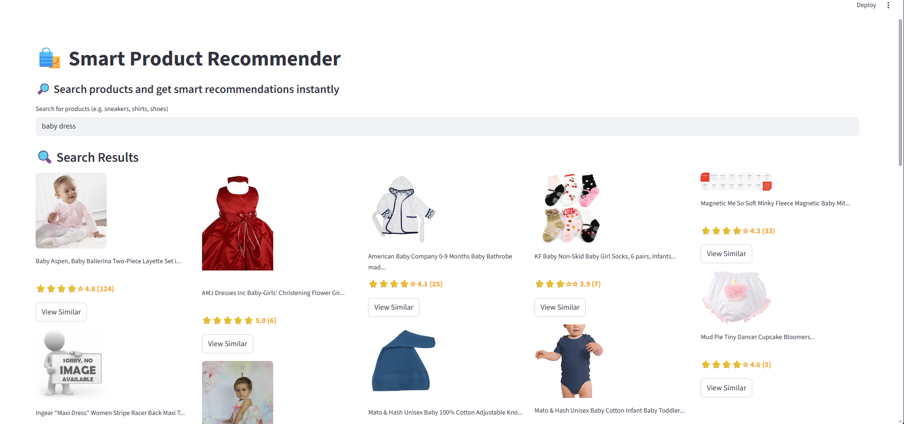

# 🛍️ Smart Product Recommender System

A real-world **Machine Learning-based Product Recommendation System** built using the **Amazon Review Dataset (2018)**.

This project simulates an **Amazon-like recommendation engine** with:
- 🔍 Smart search
- 🎯 Similar product recommendations
- 🛒 Frequently bought together items


## 📸 App Preview



---

## 📊 Dataset

This project uses the official Amazon dataset:

🔗 **Dataset Source:**  
👉 [Amazon Review Dataset](https://jmcauley.ucsd.edu/data/amazon_v2/index.html)

### 📌 Details:
- 📦 **233.1 Million Reviews**
- 🕒 Time range: **May 1996 – Oct 2018**
- 👤 Includes:
  - User reviews & ratings
  - Product metadata
  - Product relationships 

### 📂 Category Used:
- Clothing, Shoes & Jewelry
  - ~32M reviews
  

---

## 🧠 System Architecture
User Query
   ↓
Text Preprocessing
   ↓
TF-IDF Vectorization
   ↓
Cosine Similarity
   ↓
Top Relevant Products

---

## 🚀 Features

### 🔎 Smart Search
- TF-IDF based search engine
- Finds relevant products from query

### 🎯 Similar Products
- Content-based filtering
- Uses cosine similarity

### 🛒 Frequently Bought Together
- Based on co-occurrence matrix
- Mimics Amazon cross-selling

### ⭐ Ratings Display
- Formatted ratings (⭐ 4.5 (120))
- Clean UI

### 🖼️ Image Handling
- Displays product images
- Handles missing/broken images gracefully

---

## ⚙️ Tech Stack

- **Python**
- **Pandas**
- **Scikit-learn**
- **Streamlit**
- **TF-IDF Vectorizer**
- **Cosine Similarity**
- **Pickle (Model Storage)**

---

## 🧱 Project Pipeline

### 1️⃣ Data Processing
- Loaded large JSON dataset using chunk processing
- Converted to structured format (CSV/DataFrame)

### 2️⃣ Data Cleaning
- Removed null values
- Handled duplicates (user-item pairs)
- Cleaned text data

### 3️⃣ Feature Engineering
- Combined:
  - Title
  - Brand
  - Category
  - Features

### 4️⃣ Vectorization
- Applied TF-IDF on combined text

### 5️⃣ Similarity Computation
- Used cosine similarity for:
  - Search
  - Recommendation

### 6️⃣ Association Modeling
- Built co-occurrence matrix from user interactions

### 7️⃣ Model Saving
Saved as:
df_cb.pkl
cv.pkl
vectors.pkl
indices.pkl
co_occurrence.pkl


---

## 💻 Application (Streamlit)

### 🔹 Features in UI
- Search bar
- Product grid display
- Ratings & reviews
- "View Similar" button
- Recommendation sections
- Frequently bought together

### 🔹 App Flow
User types query → Search results displayed
↓
User clicks product
↓
Shows:

Similar products
Frequently bought together


---

## ▶️ Run Locally

```bash
# Clone repo
git clone https://github.com/himanshu-shekhar2327/Product-recommender-system

cd recommender-system

# Install dependencies
pip install -r requirements.txt

# Run app
streamlit run app.py
 
```
---
### 📦 Model Files

The app automatically downloads required files:

- df_cb.pkl
- cv.pkl
- vectors.pkl
- indices.pkl
- co_occurrence.pkl

## 🧠 Key Concepts Used

- Content-Based Filtering  
- Cosine Similarity  
- TF-IDF Vectorization  
- Association Rules (Co-occurrence)  
- Information Retrieval  

---


## 🚀 Deployment

This project is currently designed for local execution.

In future, it can be deployed using platforms like:

- Streamlit Cloud  
- Render  
- AWS / Cloud-based servers  

---


### 📌 Note:
Due to large model files and dataset size, deployment requires optimization such as:
- Reducing model size  
- Preloading model artifacts on server  
- Using efficient storage solutions (e.g., cloud storage/CDN)  

---

## 🚀 Future Improvements

- 🎨 Improve UI to match real e-commerce platforms (Amazon-like design)
- 🖼️ Fix broken/invalid product image URLs
- 🧠 Add better fallback for missing images (default placeholder)
- ⚡ Optimize performance for faster loading
- 🔄 Add Collaborative Filtering (User-based)
- 🤖 Build Hybrid Recommendation System
- 💰 Add price filters and sorting


---

## 📚 Citation

Jianmo Ni, Jiacheng Li, Julian McAuley  
*Justifying recommendations using distantly-labeled reviews and fine-grained aspects*  
EMNLP 2019  

---

## 👨‍💻 Author

**Himanshu Shekhar**  
B.Tech CSE | Machine Learning Enthusiast  

---

## ⭐ Support

If you like this project:

- ⭐ Star this repo  
- 🍴 Fork it  
- 🚀 Share it  